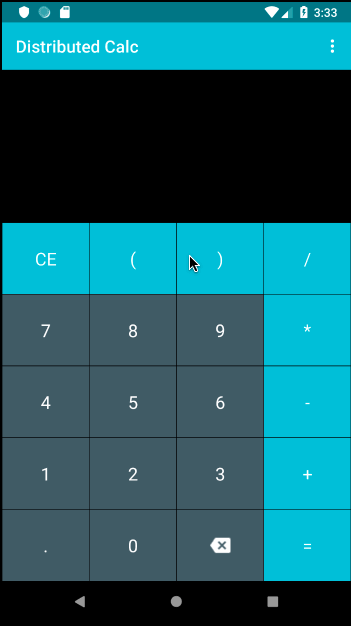

# Distributed Calculator

A distributed calculator implemented with Firebase real time database and Node.js REST api.  This is the Android app repository.

## Objective

The objective of this project is to build a proof of concept Android application to do distributed calculations using a RESTapi and coordinate connection and save history using Firebase's real time database.

## Preview

## Tech

This Android app was built in Android Studio and uses the following technologies:

-  Node.js/Express - RESTapi
-  Firebase - real time database
-  Android Studio - Android app written in Kotlin

## Links

-   [Node.js Code](https://github.com/neilroutley/nodeCalcApi)
-   [Slides](https://docs.google.com/presentation/d/1KFK6HMIvWzDN4GYvxYsSugKD73Vv2YdVuD_i7tqioNY/edit?usp=sharing)

## License

This project is licensed under the MIT License - please see the [LICENSE](LICENSE)

## Authors

-   [Neil Routley](https://github.com/neilroutley)
-   [Guy Kachur](https://github.com/GuyKachur)